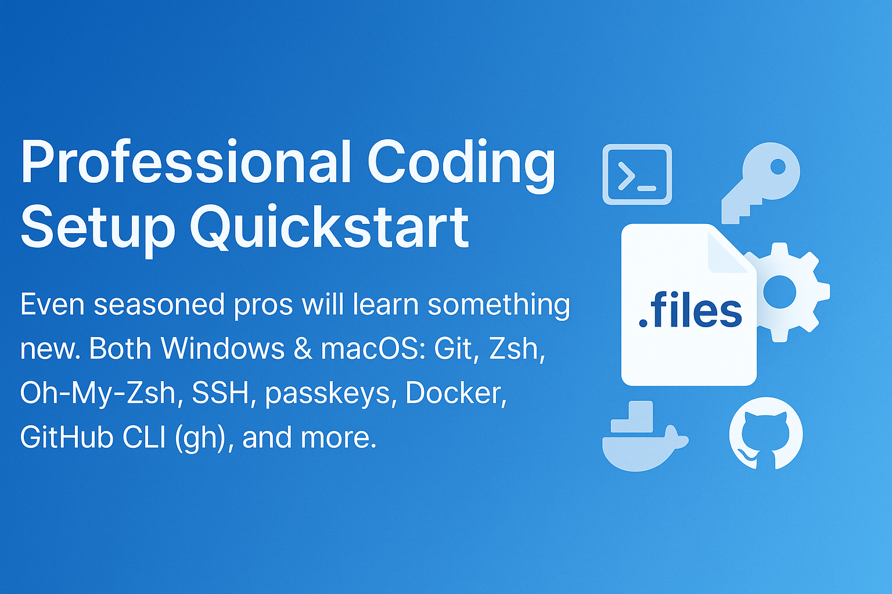

## 🧰 How to Use This Template    
Click the green **"Use this template"** button at the top of the page, then choose **"Create a new repository"**.   
This will create your own copy of this project, which you can modify freely — no need to fork!   

---

<p align="center">
  
</p>

<h1 align="center">Professional Coding Setup Quickstart</h1>

Even seasoned pros will learn something new. Both Windows &amp; macOS: Git, Zsh, Oh-My-Zsh, SSH, passkeys, Docker, GitHub CLI (gh), and more. 

---

## Table of Contents
- [Windows](#windows)
  - [Install WSL](#install-wsl)
  - [Create user & password](#create-user--password)
  - [Install Git](#install-git)
  - [Install Zsh & Oh-My-Zsh](#install-zsh--oh-my-zsh)
  - [Configure SSH & passkeys](#configure-ssh--passkeys)
  - [Install Docker](#install-docker)
  - [Install GitHub CLI (gh)](#install-github-cli-gh)
- [macOS](#macos)
  - [Install Git](#install-git-1)
  - [Install Zsh & Oh-My-Zsh](#install-zsh--oh-my-zsh-1)
  - [Configure SSH & passkeys](#configure-ssh--passkeys-1)
  - [Install Docker](#install-docker-1)
  - [Install GitHub CLI (gh)](#install-github-cli-gh-1)

---

# Windows

VS Code is the go-to editor for most professionals; the best practice is to launch it from the terminal and keep all code inside a Linux-based folder structure. We'll set that up now.

## Install WSL

1. Open PowerShell as Administrator
2. Run the command:
   ```powershell
   wsl --install
   ```
3. Restart your computer
4. WSL will finish the installation process automatically after restart

## Create user & password

When WSL first launches, you'll be prompted to create a username and password:

```
Enter new UNIX username: your_username
New password:
Retype new password:
```

Even a simple password like "/" is acceptable as this is only for your local development environment.

## Install Git

```bash
sudo apt update
sudo apt install git -y
git --version
```

## Install Zsh & Oh-My-Zsh

1. Install Zsh:
   ```bash
   sudo apt install zsh -y
   ```

2. Install Oh-My-Zsh:
   ```bash
   sh -c "$(curl -fsSL https://raw.githubusercontent.com/ohmyzsh/ohmyzsh/master/tools/install.sh)"
   ```

3. Make Zsh your default shell:
   ```bash
   chsh -s $(which zsh)
   ```

## Configure SSH & passkeys

1. Generate SSH key:
   ```bash
   ssh-keygen -t ed25519 -C "your_email@example.com"
   ```

2. Start the SSH agent:
   ```bash
   eval "$(ssh-agent -s)"
   ssh-add ~/.ssh/id_ed25519
   ```

3. For FIDO2/WebAuthn passkey:
   ```bash
   ssh-keygen -t ecdsa-sk -C "your_email@example.com"
   ```

Follow GitHub's guide for adding SSH keys to your account: [GitHub Docs: Adding a new SSH key](https://docs.github.com/en/authentication/connecting-to-github-with-ssh/adding-a-new-ssh-key-to-your-github-account)

## Install Docker

1. Install Docker Engine in WSL:
   ```bash
   sudo apt update
   sudo apt install apt-transport-https ca-certificates curl software-properties-common
   curl -fsSL https://download.docker.com/linux/ubuntu/gpg | sudo apt-key add -
   sudo add-apt-repository "deb [arch=amd64] https://download.docker.com/linux/ubuntu $(lsb_release -cs) stable"
   sudo apt update
   sudo apt install docker-ce docker-ce-cli containerd.io
   ```

2. Add your user to the docker group:
   ```bash
   sudo usermod -aG docker $USER
   ```

3. Enable Docker Desktop WSL integration through Docker Desktop settings

## Install GitHub CLI (gh)

1. Install GitHub CLI:
   ```bash
   curl -fsSL https://cli.github.com/packages/githubcli-archive-keyring.gpg | sudo dd of=/usr/share/keyrings/githubcli-archive-keyring.gpg
   echo "deb [arch=$(dpkg --print-architecture) signed-by=/usr/share/keyrings/githubcli-archive-keyring.gpg] https://cli.github.com/packages stable main" | sudo tee /etc/apt/sources.list.d/github-cli.list > /dev/null
   sudo apt update
   sudo apt install gh
   ```

2. Authenticate:
   ```bash
   gh auth login
   ```

3. Verify by cloning a repository:
   ```bash
   gh repo clone owner/repository
   ```

---

# macOS

VS Code is the go-to editor for most professionals; the best practice is to launch it from the terminal for seamless integration with your development environment.

## Install Git

1. Install Homebrew if not already installed:
   ```bash
   /bin/bash -c "$(curl -fsSL https://raw.githubusercontent.com/Homebrew/install/HEAD/install.sh)"
   ```

2. Install Git:
   ```bash
   brew install git
   git --version
   ```

## Install Zsh & Oh-My-Zsh

1. Zsh is the default shell on modern macOS. Verify with:
   ```bash
   echo $SHELL
   ```

2. Install Oh-My-Zsh:
   ```bash
   sh -c "$(curl -fsSL https://raw.githubusercontent.com/ohmyzsh/ohmyzsh/master/tools/install.sh)"
   ```

## Configure SSH & passkeys

1. Generate SSH key:
   ```bash
   ssh-keygen -t ed25519 -C "your_email@example.com"
   ```

2. Start the SSH agent:
   ```bash
   eval "$(ssh-agent -s)"
   ssh-add ~/.ssh/id_ed25519
   ```

3. For FIDO2/WebAuthn passkey:
   ```bash
   ssh-keygen -t ecdsa-sk -C "your_email@example.com"
   ```

Follow GitHub's guide for adding SSH keys to your account: [GitHub Docs: Adding a new SSH key](https://docs.github.com/en/authentication/connecting-to-github-with-ssh/adding-a-new-ssh-key-to-your-github-account)

## Install Docker

1. Download Docker Desktop for Mac from [Docker's website](https://www.docker.com/products/docker-desktop/)
2. Install the downloaded .dmg file
3. Verify installation:
   ```bash
   docker --version
   docker run hello-world
   ```

## Install GitHub CLI (gh)

1. Install GitHub CLI using Homebrew:
   ```bash
   brew install gh
   ```

2. Authenticate:
   ```bash
   gh auth login
   ```

3. Verify by cloning a repository:
   ```bash
   gh repo clone owner/repository
   ```

